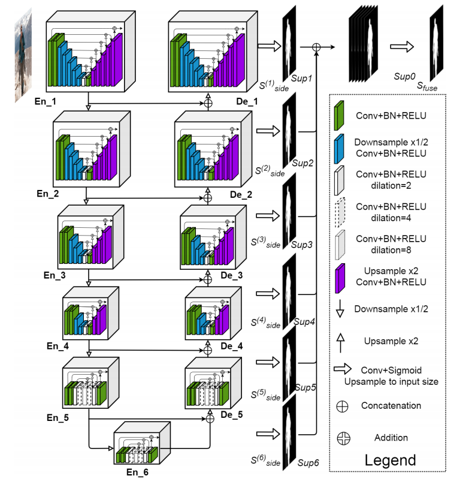

# U2-Net-Reproducibility

# 关于U2-Net: Going Deeper with Nested U-Structure for Salient Object Detection的复现

## 该项目主要是来自官方的源码
- https://github.com/xuebinqin/U-2-Net
- 注意，该项目是针对显著性目标检测领域（Salient Object Detection / SOD）

## 环境配置：
- Python3.8
- Pytorch1.10
- 使用GPU训练（一张3090）
- 详细环境配置见`requirements.txt`


## 文件结构
```
├── src: 搭建网络相关代码
├── train_utils: 训练以及验证相关代码
├── my_dataset.py: 自定义数据集读取相关代码
├── predict.py: 简易的预测代码
├── train.py: 训练代码
├── validation.py: 单独验证模型相关代码
├── transforms.py: 数据预处理相关代码
└── requirements.txt: 项目依赖
```

## DUTS数据集准备
- DUTS数据集官方下载地址：[http://saliencydetection.net/duts/](http://saliencydetection.net/duts/)

```
├── DUTS-TR
│      ├── DUTS-TR-Image: 该文件夹存放所有训练集的图片
│      └── DUTS-TR-Mask: 该文件夹存放对应训练图片的GT标签（Mask蒙板形式）
│
└── DUTS-TE
       ├── DUTS-TE-Image: 该文件夹存放所有测试（验证）集的图片
       └── DUTS-TE-Mask: 该文件夹存放对应测试（验证）图片的GT标签（Mask蒙板形式）
```

## 官方权重
使用官方权重：
`u2net_full`在DUTS-TE上的验证结果(使用`validation.py`进行验证)：

```
MAE: 0.044
maxF1: 0.868
```

## 训练记录

```
训练最终在DUTS-TE上的验证结果：
```
MAE: 0.047
maxF1: 0.857
未达到原论文训练效果，本次复现由于硬件有限，只训练了360轮，远小于原论文中训练的轮数，这可能是一个原因
```
训练过程详情可见results.txt文件


## U2NET网络结构

